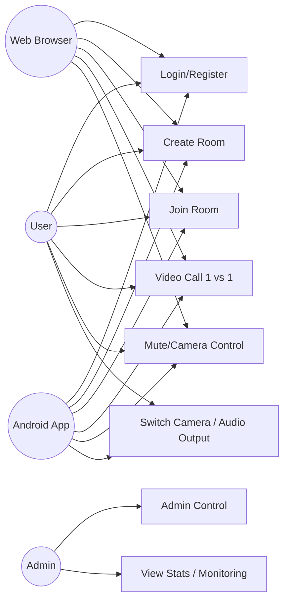
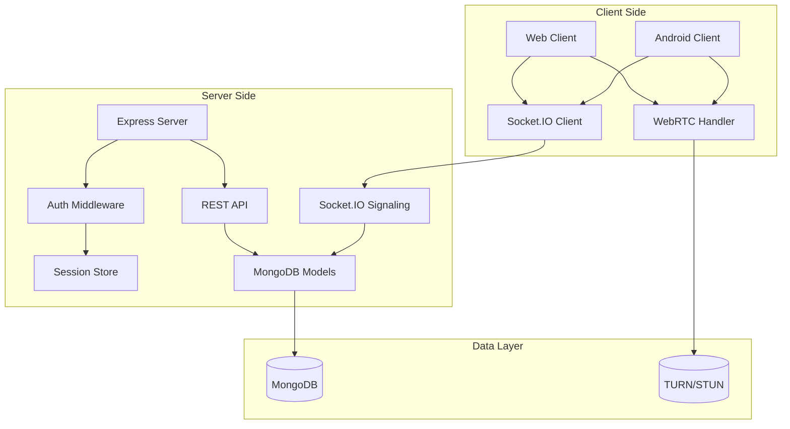
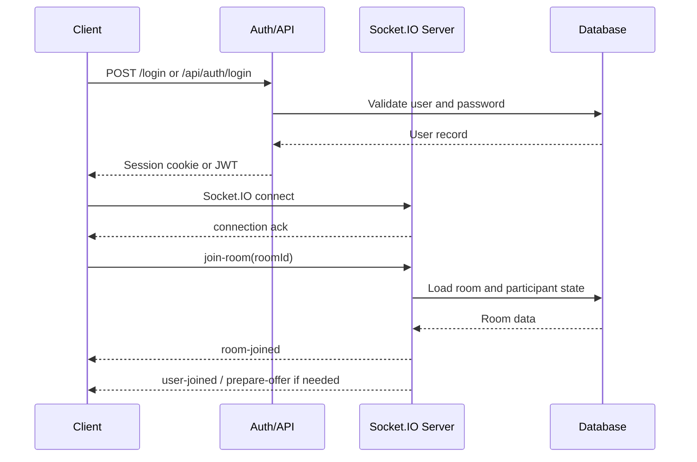
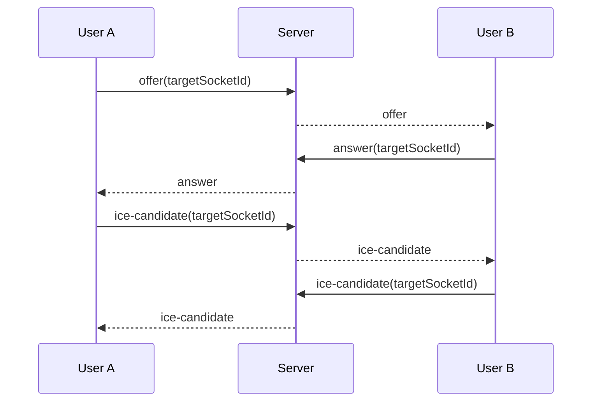
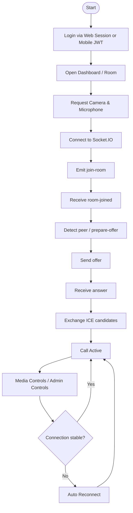

# PRD - Web Video Call Refresh

## 1. Ringkasan Produk

Project ini adalah aplikasi video call 1 vs 1 real-time yang berjalan lintas platform:
- Web browser
- Android app

Tujuan refresh project adalah mempertahankan seluruh fitur yang sudah ada pada project saat ini, tetapi dengan struktur, dokumentasi, dan kontrak backend yang lebih rapi agar aman dipakai sebagai basis pengembangan baru.

## 2. Visi Produk

Membangun platform video call real-time yang stabil, mobile-first, dan siap digunakan di web maupun Android dengan pengalaman yang konsisten, autentikasi yang jelas, dan signaling yang aman.

## 3. Tujuan Utama

1. Menyediakan video call 1 vs 1 dengan kualitas stabil.
2. Menyediakan backend yang bisa dipakai web dan mobile dari satu codebase.
3. Menjaga kontrak API dan signaling yang konsisten untuk semua client.
4. Mendukung admin control dan monitoring.
5. Menjaga kompatibilitas terhadap mobile browser dan native Android app.

## 4. Sasaran Pengguna

### 4.1 User Biasa
- Login, join room, melakukan video call.
- Mengontrol audio dan kamera.
- Punya pengalaman yang sama di web dan Android.

### 4.2 Admin
- Membuat dan memantau room.
- Mengontrol kamera dan audio user.
- Menjalankan pengawasan mode exam atau kontrol fokus jika diaktifkan.

### 4.3 Operator/Developer
- Mengelola deployment, settings, logging, dan kualitas koneksi.
- Mengembangkan fitur baru tanpa memecah kontrak web/mobile.

## 5. Ruang Lingkup Produk

### In Scope
- Authentication web berbasis session.
- Authentication mobile berbasis JWT.
- REST API untuk mobile dan integrasi eksternal.
- Socket.IO signaling untuk join room, offer, answer, dan ICE candidate.
- Video call 1 vs 1.
- Mute/unmute microphone.
- Camera on/off.
- Switch front/back camera di mobile.
- Switch audio output speaker/earpiece di mobile.
- Fullscreen lawan bicara.
- Picture-in-Picture video sendiri yang bisa dipindah.
- Auto reconnect WebRTC.
- Dark mode dan light mode.
- Room management.
- Admin control, monitoring, dan system settings.
- Stats dan logging dasar untuk kualitas koneksi.
- Dukungan cross-platform web dan Android dari backend yang sama.

### Out of Scope
- Group call multi-participant.
- Chat text real-time sebagai fitur utama.
- Recording video server-side.
- Livestream public broadcast.
- File sharing besar antar user.
- End-to-end encryption custom di luar standar WebRTC.

## 6. Prinsip Produk

1. Satu backend untuk semua client.
2. Kontrak API dan signaling harus menjadi source of truth.
3. Web boleh pakai session, mobile harus pakai JWT.
4. Server tidak boleh bergantung pada browser-only assumptions.
5. UI web dan Android boleh berbeda, tetapi perilaku inti harus sama.
6. Room dan signaling harus stabil untuk koneksi yang sering putus-nyambung.

## 7. Fitur Fungsional

### 7.1 Authentication

#### Web
- User login via form.
- Session dibuat di server.
- Logout menghapus session.

#### Mobile
- User register/login via REST API.
- Server mengembalikan JWT.
- JWT dipakai untuk API dan Socket.IO.
- JWT mobile berlaku selama 30 hari.
- Tidak perlu implementasi refresh token pada fase refresh project ini.

#### Acceptance Criteria
- User web bisa login tanpa token manual.
- User mobile bisa login dan memakai token untuk request berikutnya.
- Socket.IO menerima sesi web maupun token mobile.

### 7.2 Room Management

#### Fitur untuk User

- User dapat membuat room.
- User dapat masuk ke room dengan room ID.
- User dapat melihat status room, jumlah participant, dan status lawan bicara.
- User dapat menggunakan kontrol media di dalam room.

#### Fitur untuk Admin Web

- Admin dapat melihat daftar room aktif.
- Admin dapat menghapus room dari dashboard admin.
- Admin dapat memantau participant aktif dan status room.
- Admin dapat menggunakan kontrol advanced seperti stats, quality, focus, dan audio reset.
- Admin di web tetap dapat mengontrol user yang sedang memakai aplikasi mobile, selama user tersebut berada di room yang sama dan terautentikasi.

#### Aturan Room

- Room maksimal 2 participant.
- Room bisa direaktivasi jika sebelumnya nonaktif.
- Room detail dapat dibaca oleh client yang berwenang.
- Fitur admin hanya tersedia di web, bukan di aplikasi Android.

#### Acceptance Criteria
- Room ID unik.
- Participant count tidak melebihi batas.
- Room yang kosong bisa dibersihkan otomatis.
- Admin web dapat mengelola room tanpa memengaruhi alur dasar user.

### 7.3 Real-Time Signaling

- Client join room melalui Socket.IO.
- Server meneruskan offer, answer, dan ICE candidate.
- Server mengirim event user joined/left.
- Server mendukung reconnect dan pemulihan sesi.

#### Acceptance Criteria
- Web dan Android bisa saling terhubung dalam room yang sama.
- Signaling tidak bergantung pada browser-specific session state di client mobile.

### 7.4 Media Controls

- Toggle microphone.
- Toggle camera.
- Switch camera depan/belakang di mobile.
- Pilih audio output speaker atau earpiece di mobile.
- Tampilkan status mute dan camera off.

#### Aturan Kamera Always-On Saat Admin Control Aktif

- Jika admin control aktif dan ada admin di room, kamera user non-admin harus tetap mengirim video track aktif ke room.
- Pada kondisi ini, user hanya boleh mengubah status visual lokal atau UI state, bukan mematikan video track secara penuh.
- Tujuannya adalah agar admin tetap dapat melakukan monitoring atau exam control secara konsisten.
- Aturan ini hanya berlaku untuk web room flow yang memiliki admin control.
- Aplikasi Android tidak menampilkan fitur admin control, tetapi tetap mengikuti policy room jika room dikendalikan dari web.
- Implementasi visual mute kamera harus dilakukan di level UI dan signaling, bukan dengan mematikan track WebRTC.
- Saat mode ini aktif, payload `media-status` harus tetap mengirim `isCameraHidden: true` dan `isCameraTrackEnabled: true`.
- Jangan gunakan `track.enabled = false` atau `track.stop()` selama policy always-on aktif.

#### Acceptance Criteria
- Status media sinkron dengan lawan bicara.
- Toggle media tidak memutus koneksi peer.
- Saat admin control aktif, kamera user non-admin tetap on di sisi stream walaupun UI lokal dapat menunjukkan status visual tertentu.

### 7.5 Video Experience

- Fullscreen lawan bicara.
- Picture-in-Picture untuk preview sendiri.
- Layout mobile-first.
- Responsif untuk desktop dan mobile.

#### Acceptance Criteria
- UI tetap usable pada layar kecil.
- Video local dan remote tetap jelas dan mudah diakses.

### 7.6 Reconnect and Reliability

- Auto reconnect WebRTC.
- Retry maksimal sesuai aturan produk.
- Recovery saat socket reconnect.
- Cleanup room saat participant keluar.

#### Acceptance Criteria
- Koneksi yang putus sementara dapat pulih tanpa user harus mulai ulang seluruh alur.

### 7.7 Admin Control

- Admin dapat melihat room dan user aktif.
- Admin dapat mematikan kamera user.
- Admin dapat mematikan audio user.
- Admin dapat mengontrol fitur global tertentu.
- Admin control bisa dinyalakan/dimatikan dari settings.
- Fitur admin hanya tersedia di web.

#### Kontrol Admin di Dalam Room

Kontrol admin yang harus tersedia saat admin berada di room web:

- WebRTC stats panel untuk memantau kualitas koneksi.
- Video quality panel untuk mengubah resolusi, bitrate, dan framerate.
- Focus control panel untuk mengatur mode fokus, focus distance, dan point of interest.
- Audio reset panel untuk melakukan restart audio user.
- Force rejoin untuk memaksa user reconnect ulang.
- User camera control untuk menyalakan atau mematikan kamera user.
- Switch user camera untuk mengirim perintah pergantian kamera user.
- Ring user untuk memberi notifikasi/gertar ring ke user.

#### Tombol Admin yang Ada di Room Web

Tombol admin yang tampil di room web ketika syaratnya terpenuhi:

- `Stats` atau `WebRTC Stats` untuk membuka dan menutup stats panel.
- `Video Quality Settings` untuk membuka dan menutup panel quality.
- `Focus Control` untuk membuka dan menutup panel focus.
- `Audio Reset` untuk membuka dan menutup panel reset audio.
- `Nonaktifkan kamera user` / `Aktifkan kamera user` untuk toggle kamera user.
- `Switch kamera user` untuk mengirim perintah pindah kamera ke user.
- `Panggil user` / `Ring User` untuk memicu ring alert.
- `Restart Audio` untuk melakukan soft reset audio.
- `Force Rejoin User` untuk memaksa user reconnect.

#### Kondisi Munculnya Tombol

- Tombol admin hanya muncul jika `isAdmin` dan `adminControlEnabled` bernilai aktif.
- Tombol admin hanya muncul pada web room page.
- Aplikasi Android tidak menampilkan tombol admin.
- Jika remote participant bukan user yang bisa dikontrol, tombol admin terkait user disembunyikan.
- Kontrol admin web tetap bisa diterapkan ke user yang mengakses room dari aplikasi Flutter, selama payload signaling dan room state valid.

#### Camera Policy Saat Admin Control On

- Dalam room yang berisi admin dan user, kamera user non-admin mengikuti policy always-on saat admin control aktif.
- Admin dapat melihat stream user secara konsisten untuk kebutuhan monitoring.
- Jika user mencoba mematikan kamera, sistem dapat menyimpan status visual lokal tetapi stream policy tetap aktif selama admin control on.

#### Acceptance Criteria
- Hanya role admin yang dapat mengeksekusi event admin.
- Kontrol admin tetap aman untuk web dan mobile.
- Aplikasi Android tidak menampilkan fitur admin control.
- Policy always-on untuk kamera hanya berlaku ketika admin control aktif dan admin memang berada di room.
- Tombol admin yang tampil harus sesuai role dan state room.
- Admin web dapat mengontrol user mobile tanpa memerlukan UI admin di aplikasi mobile.

### 7.8 Settings and Monitoring

- Global settings untuk mode, quality, dan kontrol admin.
- Stats dasar untuk melihat performa koneksi.
- Logging untuk debugging web dan mobile.

#### Acceptance Criteria
- Admin atau operator dapat menyesuaikan pengaturan tanpa mengubah client.

## 8. User Flow Utama

### 8.1 Web Flow
1. User membuka halaman login.
2. User login dengan session.
3. User masuk dashboard.
4. User buat atau join room.
5. Browser meminta camera/mic.
6. Socket.IO join room.
7. WebRTC negotiation berjalan.
8. Call berlangsung.

### 8.2 Mobile Flow
1. User login melalui REST API.
2. App menyimpan JWT.
3. User buat atau join room.
4. App meminta permission kamera/mikrofon.
5. App connect ke Socket.IO dengan JWT.
6. WebRTC negotiation berjalan.
7. Call berlangsung.

### 8.3 UML - Use Case Diagram



### 8.4 UML - Component Diagram



### 8.5 UML - Sequence Diagram for Auth and Join Room



### 8.6 UML - Sequence Diagram for WebRTC Signaling



### 8.7 Flow Diagram - End-to-End Call



## 9. Kebutuhan Per Halaman / Screen

Bagian ini menjelaskan komponen minimum yang harus ada pada setiap halaman/screen agar refresh project tetap setara dengan project saat ini.

### 9.1 Login Page

Komponen wajib:
- Logo dan branding aplikasi.
- Form username.
- Form password.
- Toggle show/hide password.
- Alert error jika login gagal.
- Tombol login.
- Link ke halaman register.
- Toggle theme dark/light.

Behavior:
- Validasi input sebelum submit.
- Redirect ke dashboard jika login berhasil.
- Desain harus mobile-friendly.

### 9.2 Register Page

Komponen wajib:
- Logo dan branding aplikasi.
- Form username.
- Form display name opsional.
- Form password.
- Form konfirmasi password.
- Alert error jika validasi gagal.
- Tombol daftar.
- Link ke halaman login.
- Toggle theme dark/light.

Behavior:
- Validasi panjang username dan password.
- Validasi password dan confirm password harus sama.
- Setelah register berhasil, user bisa masuk ke dashboard.

### 9.3 Dashboard / Home Page

Komponen wajib:
- Header aplikasi dengan nama app.
- Info user login.
- Badge admin jika role admin.
- Tombol logout.
- Toggle theme dark/light.
- Tombol admin panel untuk role admin.
- Card untuk membuat room baru.
- Input untuk join room dengan Room ID.
- Daftar room terakhir / recent rooms.
- Empty state jika belum ada room.
- Di web, dashboard juga menjadi pintu masuk ke panel admin untuk role admin.

Behavior:
- User dapat membuat room baru dari dashboard.
- User dapat join room dengan mengetik Room ID.
- User dapat melihat room terakhir yang relevan dengan akun mereka.
- Admin dapat masuk ke panel admin dari halaman ini.

### 9.4 Room / Call Page

Komponen wajib:
- Remote video area sebagai tampilan utama.
- Remote overlay berisi nama user dan indikator status mute/camera.
- Waiting state ketika peer belum join.
- Room ID display.
- Tombol copy Room ID.
- Local video preview / Picture-in-Picture.
- Local label dan local status indicator.
- Panel stats untuk admin.
- Panel video quality untuk admin.
- Panel focus control untuk admin.
- Panel audio reset untuk admin.
- Room controls yang relevan dengan media call.
- Di mobile, room screen hanya menampilkan kontrol user, tanpa panel admin.

#### Tombol Admin Web di Room

- `Stats` atau `WebRTC Stats`.
- `Video Quality Settings`.
- `Focus Control`.
- `Audio Reset`.
- `Nonaktifkan kamera user` / `Aktifkan kamera user`.
- `Switch kamera user`.
- `Panggil user`.
- `Restart Audio`.
- `Force Rejoin User`.

#### Tombol User di Room

- Back / kembali ke dashboard.
- Mic on/off.
- Camera on/off.
- Mirror preview.
- Switch camera (mobile).
- Screen share.
- Hide/Show PIP.
- Hide/Show buttons.
- Copy Room ID.
- End call / leave room.

Behavior:
- Room page harus langsung menyiapkan kamera dan mikrofon.
- Socket.IO join room dilakukan setelah media siap.
- User bisa melihat status lawan bicara secara real-time.
- Admin dapat melihat stats dan mengubah kualitas video saat fitur aktif.
- Mobile layout harus menjaga local preview tetap usable.
- Fitur admin advanced hanya muncul di web.

### 9.5 Admin Dashboard Page

Komponen wajib:
- Ringkasan statistik user, admin, room aktif, dan room total.
- Daftar room terbaru.
- Daftar user online.
- Status admin control aktif/nonaktif.

Behavior:
- Menjadi landing page admin setelah login.
- Menampilkan kondisi sistem secara ringkas.

### 9.6 Admin Users Page

Komponen wajib:
- Tabel daftar user.
- Search user.
- Filter role.
- Pagination.
- Tombol create user.
- Edit user.
- Delete user.
- Reset password user.

Behavior:
- Hanya admin yang dapat mengakses.
- CRUD user harus memakai validasi server-side.

### 9.7 Admin Rooms Page

Komponen wajib:
- Tabel daftar room.
- Informasi created by, status aktif, participant count, dan last activity.
- Tombol delete room.
- Tombol cleanup room tidak aktif.

Behavior:
- Admin dapat menghapus room aktif maupun membersihkan room yang tidak aktif.

### 9.8 Admin Stats Page

Komponen wajib:
- Ringkasan statistik harian.
- Grafik atau visualisasi weekly stats.
- Real-time stats endpoint.
- Informasi kualitas koneksi dan aktivitas sistem.

Behavior:
- Digunakan untuk monitoring performa dan penggunaan sistem.

### 9.9 Mobile App Screens

Jika project refresh juga mencakup app Android, layar minimum yang harus ada adalah:
- Login screen.
- Register screen.
- Dashboard / room list screen.
- Room detail / call screen.
- Admin panel atau admin-only sections jika fitur admin disediakan di mobile.

Prinsip mobile:
- Fungsionalitas harus setara dengan web, tetapi layout boleh berbeda.
- Client mobile tidak boleh bergantung pada session browser.

## 10. Data Model Tingkat Tinggi

### User
- username: String
- email: String | null
- passwordHash: String
- role: String enum('admin', 'user')
- displayName: String
- isOnline: Boolean
- lastActive: Date

### Room
- roomId: String
- name: String
- createdBy: ObjectId (ref User)
- participants: Array of Objects
	- userId: ObjectId (ref User)
	- socketId: String
	- role: String enum('admin', 'user')
	- joinedAt: Date
	- isMuted: Boolean
	- isCameraOff: Boolean
	- actualCameraOn: Boolean
- isActive: Boolean
- maxParticipants: Number default 2
- isExamMode: Boolean
- lastActivity: Date

### Stats
- callDurationMs: Number
- bytesSent: Number
- bytesReceived: Number
- connectionState: String
- reconnectCount: Number
- packetLoss: Number
- latencyMs: Number

### Settings
- adminControlEnabled: Boolean
- videoQualityDefaults: Object
- webRtcMode: String enum('mesh')
- sfuModeEnabled: Boolean (placeholder only, future use)
- konfigurasi lain yang bersifat global

### Data Model Rules

- `participants` harus berupa array of objects, bukan array of socket ID string.
- `createdBy` dan `userId` harus bertipe `ObjectId` dan merujuk ke koleksi `users`.
- `maxParticipants` default adalah 2.
- Fase refresh project ini murni memakai WebRTC P2P (Mesh); field SFU hanya placeholder untuk pengembangan masa depan dan tidak boleh memicu implementasi media server SFU di backend saat ini.

## 11. Platform Requirements

### Web
- Browser modern.
- WebRTC support.
- HTTPS untuk production.
- Session cookie support.

### Android
- Camera dan microphone permission.
- Socket.IO client.
- WebRTC native support melalui wrapper/mobile SDK.
- Secure storage untuk JWT.

### Cross-Platform
- Payload API dan event socket harus sama.
- Identity user harus konsisten di semua client.
- Backend tidak boleh mengasumsikan browser-only behavior.

## 12. API Contract Reference

Kontrak API final untuk project refresh ini harus mengikuti dokumen berikut:
[10-API_CONTRACT_FINAL.md](dokumentasi/10-API_CONTRACT_FINAL.md)

### API Scope

- Web tetap memakai route tradisional berbasis session.
- Mobile dan client eksternal memakai REST API berbasis JWT.
- Endpoint yang menjadi acuan utama:
	- `POST /api/auth/register`
	- `POST /api/auth/login`
	- `GET /api/auth/me`
	- `POST /api/room/create`
	- `GET /api/room/:roomId`

### API Contract Rules

- Response API harus JSON.
- Room contract final memakai `createdBy`, bukan `host`.
- Mobile auth harus memakai `Authorization: Bearer <token>`.
- Web session tidak boleh dijadikan satu-satunya asumsi untuk client non-browser.

### API Acceptance Criteria

- Web dan Android bisa memakai backend yang sama.
- Client baru dapat dibangun dari kontrak API tanpa membaca kode internal terlebih dahulu.
- Tidak ada mismatch antara schema room dan payload API.

## 13. WebRTC and Signaling Contract Reference

Kontrak signaling final untuk project refresh ini harus mengikuti dokumen berikut:
[11-WEBRTC_SIGNALING_CONTRACT_FINAL.md](dokumentasi/11-WEBRTC_SIGNALING_CONTRACT_FINAL.md)

### Signaling Scope

- `join-room`
- `room-joined`
- `user-joined`
- `offer`
- `answer`
- `ice-candidate`
- `media-status`
- event admin control terkait kamera, audio, focus, dan ring

### Signaling Contract Rules

- Server menentukan identity user dari session atau JWT.
- Client join room hanya perlu mengirim `roomId`.
- Payload signaling harus stabil untuk web dan Android.
- Media tetap peer-to-peer atau SFU; server hanya menjadi signaling layer.

### WebRTC Acceptance Criteria

- Web dan Android bisa saling call di room yang sama.
- ICE candidate exchange berjalan end-to-end.
- Status mute/camera sinkron ke peer.
- Auto reconnect dan room recovery bekerja saat koneksi putus sementara.

## 14. Tech Stack

### Backend
- Node.js
- Express.js
- Socket.IO
- MongoDB
- Mongoose
- Express Session
- connect-mongo
- JSON Web Token
- bcryptjs
- uuid

### Frontend Web
- Tailwind CSS
- EJS
- Vanilla JavaScript
- HTML5
- CSS3
- Socket.IO Client
- WebRTC browser API

### Frontend Web Styling Notes
- Tailwind dipakai sebagai framework CSS utama untuk web.
- Custom CSS boleh dipakai untuk komponen khusus yang tidak efisien bila ditulis dengan utility class.
- UI web harus tetap mobile-first dan konsisten dengan design system yang dibangun di atas Tailwind.

### Mobile
- Mobile Framework: Flutter (Dart)
- Socket.IO client: `socket_io_client`
- WebRTC wrapper: `flutter_webrtc`
- Secure storage untuk JWT
- Target utama: Android

### Media and Connectivity
- WebRTC
- STUN
- TURN / CoTURN
- P2P Mesh only pada fase refresh ini
- SFU hanya placeholder/flag future use, bukan implementasi media server saat ini

### Operations and Deployment
- Nginx atau reverse proxy setara
- HTTPS / TLS
- MongoDB Atlas atau self-hosted MongoDB
- PM2 atau process manager setara

### Tech Stack Acceptance Criteria

- Stack mendukung web browser dan Android dari satu backend.
- Stack cukup untuk mode session web dan JWT mobile.
- Stack mendukung WebRTC signaling dan NAT traversal melalui STUN/TURN.

## 15. Struktur Folder

Struktur folder berikut menjadi acuan untuk project refresh agar pemisahan backend, web, dan apps tetap jelas.

### 15.1 Backend Structure

```text
src/
├── server.js
├── config/
│   ├── database.js
│   └── webrtc.js
├── middleware/
│   └── auth.js
├── models/
│   ├── User.js
│   ├── Room.js
│   ├── Stats.js
│   └── Settings.js
├── routes/
│   ├── auth.js
│   ├── room.js
│   ├── admin.js
│   └── api.js
├── socket/
│   └── socketHandler.js
└── views/
	├── layout.ejs
	├── login.ejs
	├── register.ejs
	├── home.ejs
	├── room.ejs
	└── admin/
		├── dashboard.ejs
		├── users.ejs
		├── rooms.ejs
		└── stats.ejs
```

### 15.2 Web Structure

```text
public/
├── css/
│   ├── style.css
│   └── room.css
├── js/
│   ├── theme.js
│   ├── room.js
│   ├── webrtc.js
│   ├── ionSFUClient.js
│   ├── videoQualityPresets.js
│   └── admin helpers / UI logic
└── assets/
	├── icons/
	└── images/
```

Catatan web:
- Tailwind CSS menjadi framework utama styling web.
- Custom CSS hanya untuk komponen yang sulit atau tidak efisien jika dibuat full utility class.
- Semua halaman web harus mobile-first.

### 15.3 Apps Structure

```text
vcapps/
├── pubspec.yaml
├── lib/
│   ├── main.dart
│   ├── core/
│   │   ├── models/
│   │   ├── services/
│   │   └── utils/
│   ├── screens/
│   │   ├── login/
│   │   ├── register/
│   │   ├── dashboard/
│   │   └── room/
│   └── widgets/
├── android/
├── ios/
├── web/
├── linux/
├── macos/
└── windows/
```

Catatan apps:
- Framework mobile adalah Flutter (Dart).
- `flutter_webrtc` dipakai untuk media.
- `socket_io_client` dipakai untuk signaling.
- Admin panel tidak wajib ada di apps; fitur admin cukup di web.

### 15.4 Structure Rules

- Backend, web, dan apps harus dipisah jelas.
- Kontrak API dan signaling disimpan sebagai dokumentasi terpisah.
- Kode web tidak boleh bercampur dengan kode Flutter.
- Kode mobile tidak boleh bergantung pada session browser.
- Admin control logic harus disentralisasi di backend/socket layer sehingga berlaku untuk web user maupun mobile user.

## 16. Non-Functional Requirements

### Performance
- Join room dan signaling harus terasa real-time.
- UI responsif di mobile.
- Server harus mampu menangani reconnect dan churn.

### Reliability
- Room cleanup harus aman.
- Autoreconnect harus mencegah call putus permanen.
- TURN server tersedia untuk NAT traversal.

### Security
- Password disimpan hash.
- JWT untuk mobile.
- Session untuk web.
- HTTPS wajib di production.
- Admin-only action harus divalidasi server-side.

### Maintainability
- Kontrak API dan signaling terdokumentasi.
- Source of truth hanya satu versi.
- Dokumentasi harus sinkron dengan implementasi.

## 17. Success Metrics

1. Web dan Android bisa saling video call dalam room yang sama.
2. Login web dan mobile bekerja sesuai model auth masing-masing.
3. Koneksi media berhasil pulih setelah disconnect singkat.
4. Admin control bekerja tanpa bypass security.
5. Dokumentasi API dan signaling cukup jelas untuk implementasi client baru.

## 18. Acceptance Criteria Produk Refresh

Produk dianggap siap jika:
- Semua fitur inti project lama tersedia lagi.
- Kontrak API final dipakai untuk client baru.
- Kontrak signaling final dipakai untuk web dan Android.
- Room management, auth, dan call flow berjalan end-to-end.
- Tidak ada ketergantungan client mobile pada `req.session.userId` atau asumsi browser session.
- Dokumentasi terbaru tersedia sebagai acuan implementasi.

## 19. Deliverables untuk Project Baru

1. Backend server baru dengan auth web dan mobile.
2. REST API contract final.
3. WebRTC signaling contract final.
4. Flow reference untuk auth, room, dan call.
5. Frontend web modern yang mempertahankan fitur lama.
6. Mobile app Android yang kompatibel dengan backend yang sama.
7. Dokumentasi setup, deployment, dan troubleshooting.

## 20. Rekomendasi Implementasi

- Gunakan satu source of truth untuk API dan signaling.
- Pisahkan layer web session dan mobile JWT sejak awal.
- Buat integration test untuk auth, room, dan signaling.
- Pastikan schema data konsisten sebelum membangun client baru.
- Jadikan dokumentasi kontrak final sebagai acuan utama tim.

## 21. Catatan Penting

Project refresh ini harus dianggap bukan sekadar redesign UI, tetapi penyusunan ulang fondasi produk agar benar-benar siap cross-platform.

Fokus utama adalah menjaga semua fitur yang sudah ada tetap tersedia, sambil memperbaiki konsistensi kontrak, dokumentasi, dan struktur agar aman dikembangkan ke web dan Android.