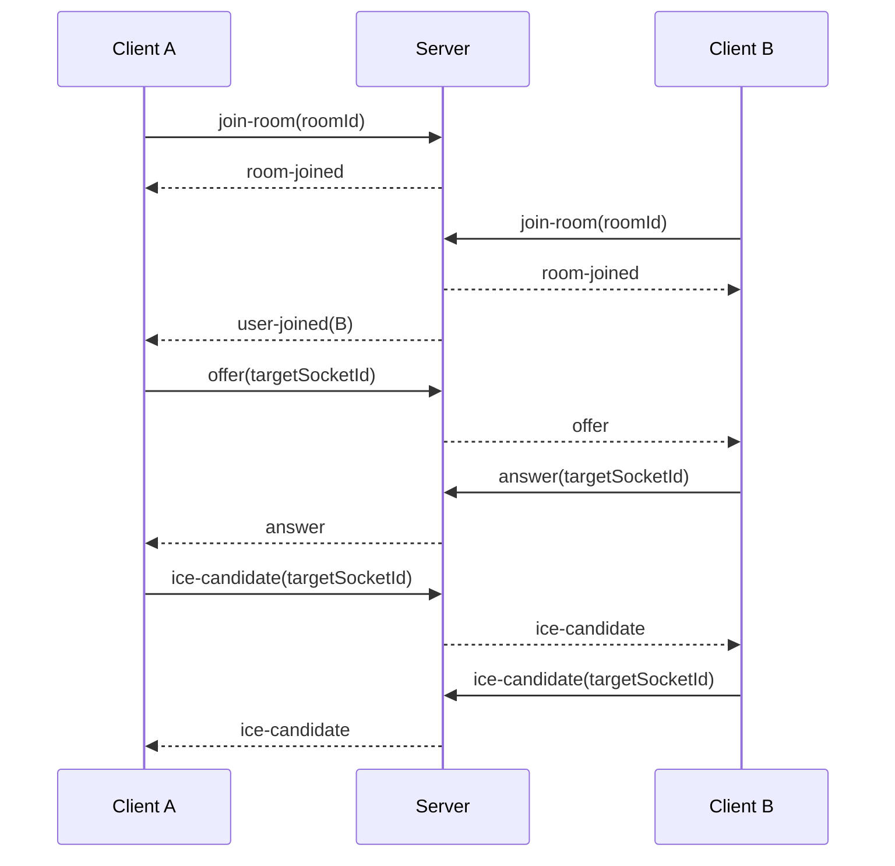

# 🔁 Flow Reference - Auth, Room, and Call

Dokumen ini menjelaskan flow end-to-end yang bisa dijadikan acuan implementasi web dan Android.

## 1. Auth Flow

### Web Browser

1. User membuka halaman login.
2. User submit username/password ke `/login`.
3. Server membuat session.
4. Browser menyimpan cookie session.
5. Request berikutnya memakai session otomatis.

### Android / Mobile App

1. App login ke `/api/auth/login`.
2. Server mengembalikan JWT.
3. App menyimpan token di secure storage.
4. App mengirim token saat konek Socket.IO.

## 2. Room Flow

### Create Room

1. Client yang sudah login memanggil create room.
2. Server membuat `roomId`.
3. Server menyimpan `createdBy` sebagai pemilik room.
4. Server mengembalikan data room.

### Join Room

1. Client ambil room detail jika diperlukan.
2. Client request camera/mic.
3. Client connect ke Socket.IO.
4. Client emit `join-room` dengan `roomId`.
5. Server validasi auth dan room state.
6. Server mengirim `room-joined` ke client.
7. Jika ada peer lain, server kirim `user-joined`.

## 3. Call Negotiation Flow

## 4. Media State Flow

1. Client toggle mute/camera.
2. Client update local UI.
3. Client emit `media-status`.
4. Server update participant state.
5. Peer menerima update untuk sinkronisasi tampilan.

## 5. Admin Control Flow

1. Admin join room dengan role admin.
2. Admin membuka kontrol kamera/audio.
3. Server memastikan admin control aktif.
4. Server meneruskan event ke user target.
5. User client menjalankan aksi yang diminta.

## 6. Cleanup Flow

1. Peer disconnect.
2. Server update participant list.
3. Jika room kosong, server menandai room untuk cleanup.
4. Jika peer kembali join, room bisa direaktivasi selama belum dihapus.

## 7. Rekomendasi Implementasi Client

- Web dan Android harus memakai event name yang sama.
- Identity jangan diambil dari payload join-room, tapi dari auth context.
- UI boleh berbeda, tapi contract event dan response harus sama.
- Jika butuh fitur baru, tambahkan ke kontrak dulu sebelum implementasi.